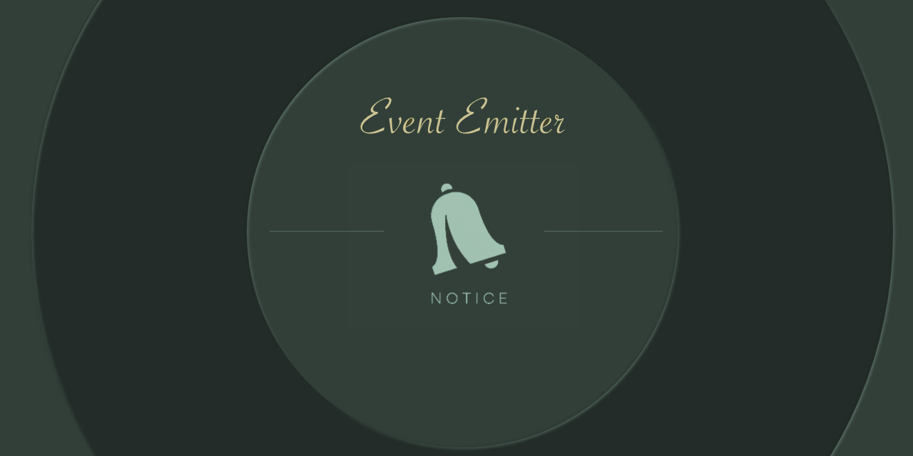

----


# Notice (@peter.naydenov/notice)


`Notice` is an simple event emitter. Define a behaviour related to event and then trigger the event.  
Register multiple callbacks to the same event. Order of execution is the same as the order of registration.
Use method '**stop**' to mute the event for a while. Use method '**start**' to unmute the event. Method '**off**' will remove the event and all related callbacks. Method 'reset' will remove all events and functions from the event emitter.


## Last Updates
- After version 2.1.0  Method 'reset' was added. It removes all events and functions from the event emitter;
- After version 2.3.0  If callback that returns a string 'stop', the execution of followed callbacks will be stopped. Use this functionality to create a condition checking functions before  your main callback if needed;
- In version 2.3.1 and above: Callback stop will stop the wildcard callbacks as well;


## Installation
Write in your project

```
npm install @peter.naydenov/notice
```


## How to use it
Here is simple example for using this trivial event emitter:
```js
// with ES6 modules:
import notice from '@peter.naydenov/notice'
// with CommonJS:
// const notice = require('@peter.naydenov/notice')
const eBus   = notice ();

eBus.on ( 'note' , () => console.log ( 'hey!')   )
eBus.emit ( 'note' )
// ---> 'hey!'

// example 2
eBus.on ( 'note' , () => console.log ( 'hey!')   )
eBus.on ( 'note' , () => console.log ( 'ho!')   )
eBus.emit ( 'note' )   // will execute all functions related to the event
// ---> 'hey!ho!'

// example 3
eBus.on ( 'note' , () => console.log ( 'hey!')   )
eBus.on ( 'note' , () => console.log ( 'ho!')   )
eBus.off ( 'note' )   // will remove all functions related to the event
eBus.emit ( 'note' )   // nothing will happen

// example 4
let x = 0;
eBus.on ( 'note' , () => { 
                        console.log ( 'hey!')
                        if ( x === 0 ) {
                                x++
                                return 'stop'
                            }
                })
eBus.on ( 'note' , () => {
                        console.log ( 'ho!')
                        x++
                  })
eBus.emit ( 'note' )   // Will execute only the first function. If callback returns 'stop', the execution of callbacks will be stopped.
// ---> 'hey!'
// x == 1


// example 5
eBus.on ( 'note' , () => console.log ( 'hey!')   )
eBus.stop ( 'note' )   // will mute the event
eBus.emit ( 'note' )   // nothing will happen
eBus.start ( 'note' )  // will unmute the event
eBus.emit ( 'note' )   // ---> 'hey!'
```


## Methods

```js
{
      on    : 'Register a event'
    , once  : 'Register a single event'
    , off   : 'Unregister regular and single events'
    , reset : 'Remove all events and functions from the event emitter' // After version 2.1.0
    , emit  : 'Trigger a event'
    , stop  : 'Ignore event for a while'
    , start : 'Remove event from ignore list'
    , debug : 'Returns a console message on each triggered event'
}
```

### Notice.on ( eventName, fn )
Register a regular event.
- **eventName**: *string*. Name of the event;
- **fn**: *function*. Behaviour that will be assigned to this eventName;
```js
  const eBus = notice ();

  eBus.on ( 'start', name => console.log ( `Hey, ${name}!` )   )   
  eBus.emit ( 'start', 'Johny' )
// ---> Hey, Johny!
  eBus.emit ( 'start', 'Vessy' )
// ---> Hey, Vessy!
```


### Notice.once ( eventName, fn )
Register a single event.
- **eventName**: *string*. Name of the event;
- **fn**: *function*. Behaviour that will be assigned to this eventName;
```js
const eBus = notice ();

eBus.once ( 'start', name => console.log ( `Hey, ${name}!` )   )
eBus.emit ( 'start', 'Johny' )
// ---> Hey, Johny!
eBus.emit ( 'start', 'Vessy' )
// ---> null. It's a single event and can be triggered only once.
```


### Notice.off ( eventName, fn )
Remove a behaviour(function) related to the event. If 'fn' is not provided, all behaviours related to this event will be removed. Function works with all types of event ( regular and single )
- **eventName**: *string*. Name of the event;
- **fn**(optional): *function*. Behaviour that will be assigned to this eventName;
```js
let result = 0;
const 
      eBus = notice ()
    , fn1 = () => result += 1
    , fn2 = () => result += 3
    , fn3 = () => result += 20
    ;

 eBus.on ( 'go', fn1 )
 eBus.on ( 'go', fn2 )
 eBus.emit ( 'go' )
// ---> result == 4
 eBus.off ( 'go', fn2 )   // fn2 is unsubscribed
 eBus.emit ( 'go' )       // Only fn1 is subscibed.
// ---> result == 5

 eBus.on ( 'go', fn2 )
 eBus.on ( 'go', fn3 )
 // All functions are subscribed now
 eBus.off ( 'go' )       // Unsubscribe the event
 eBus.emit ( 'go' )
 // ---> result == 5. Nothing changed
```

### Notice.reset ( )
Will remove all events and functions from the event emitter.
```js
let result = 0;
const 
      eBus = notice ()
    , fn1 = () => result += 1
    , fn2 = () => result += 3
    , fn3 = () => result += 20
    ;

 eBus.on ( 'go', fn1 )
 eBus.on ( 'go', fn2 )
 eBus.on ( 'load', fn3 )
 eBus.reset () // Remove all events and functions
 eBus.emit ( 'go' )
 eBus.emit ( 'load' )
// ---> result == 0
```


### Notice.emit ( eventName, data )
Trigger the event and execute all subscribed functions.
- **eventName**: *string*. Name of the event;
- **data**(optional): *any*. 

```js
let result = 0;
const 
      eBus = notice ()
    , fn1 = x => result += 1 + x
    , fn2 = x => result += 3 + x
    ;
 eBus.on ( 'go', fn1 )
 eBus.on ( 'go', fn2 )
 eBus.emit ( 'go', 2 )
// ---> result == 8
```


### Notice.stop ( eventName )
Disable specified event.
- **eventName**: *string*. Name of the event;

```js
let result = 0;
const 
      eBus = notice ()
    , fn1 = x => result += 1 + x
    , fn2 = x => result += 3 + x
    ;
 eBus.on ( 'go', fn1 )
 eBus.on ( 'go', fn2 )
 eBus.stop ( 'go' )     // Functions are still subscribed but event is muted
 eBus.emit ( 'go', 2 )
// ---> result == 0
```


### Notice.start ( eventName )
Enable again specified event.
- **eventName**: *string*. Name of the event;

```js
let result = 0;
    const 
          eBus = notice ()
        , fn1 = x => result += 1 + x
        , fn2 = x => result += 3 + x
        ;
     eBus.on ( 'go', fn1 )
     eBus.on ( 'go', fn2 )
     eBus.stop ( 'go' )
     eBus.emit ( 'go', 2 )
    // ---> result == 0
     eBus.start ( 'go' )
     eBus.emit ( 'go', 1 )
     console.log ( result )
     // ---> result == 6 
```


### Notice.debug ( state, label )
Provide debug message on each event. By default is debug is 'off'.

```js
// Turn debug "on"
eBus.debug ( true )

// Turn debug "off"
eBus.debug ( false )

// Activate debugger and set a debug message prefix
eBus.debug ( true, '[eBus]:' )
eBus.emit ( 'dummy' )
// --> [eBus]: Event "dummy" was triggered.
```


## External Links

- [History of changes](https://github.com/PeterNaydenov/notice/blob/master/Changelog.md)
- [MIT License](https://github.com/PeterNaydenov/notice/blob/master/LICENSE)


## Credits
'notice' was created and supported by Peter Naydenov.


## License
'notice' is released under the [MIT License](https://opensource.org/licenses/ISC).