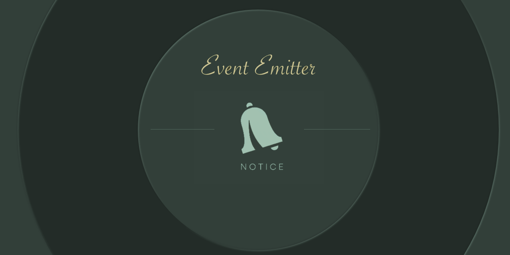

----


# Notice (@peter.naydenov/notice)


`Notice` is an simple event emitter. Define a behaviour related to event and then trigger the event.  
Register multiple callbacks to the same event. Once callbacks run first, followed by regular callbacks, then wildcard callbacks. Within each group, callbacks run in registration order.
Use method '**stop**' to mute the event for a while. Use method '**start**' to unmute the event. Method '**off**' will remove the event and all related callbacks. Method 'reset' will remove all events and functions from the event emitter.


## Last Updates
- After version 2.1.0  Method 'reset' was added. It removes all events and functions from the event emitter;
- After version 2.3.0  If callback that returns a string 'stop', the execution of followed callbacks will be stopped. Use this functionality to create a condition checking functions before your main callback if needed;
- In version 2.3.1 and above: Callback stop will stop the wildcard callbacks as well;
- In version 2.4.0  Event names can be `Symbol`s, in addition to strings;
- In version 2.5.0  Subscriber callbacks that throw no longer abort the rest of the event chain — each call is wrapped in try/catch and the error is logged to `console.error`;
- In version 2.4.4  Reserved object property names (`'__proto__'`, `'constructor'`) can be used as event names — the internal `scroll` map uses a null-prototype object, so these keys are safe;
- In version 2.4.4  Removing the last `'once'` subscriber with `off` no longer deletes the regular subscribers of the same event;
- In version 2.5.0  `on` and `once` silently no-op when the `fn` argument is not a function (previously they stored the value and threw `'fn is not a function'` at `emit` time);
- In version 2.4.4  Wildcard `emit('*')` and wildcard `stop('*')` / `start('*')` now correctly handle `Symbol` event names;
- In version 2.4.4  Debug mode (`eBus.debug(true, '[HDR]')`) works with `Symbol` event names — the event name is stringified with `String(e)`;


## Installation
Write in your project

```
npm install @peter.naydenov/notice
```


## How to use it
Here is simple example for using this trivial event emitter:
```js
// with ES6 modules:
import notice from '@peter.naydenov/notice'
// with CommonJS:
// const notice = require('@peter.naydenov/notice')
const eBus   = notice ();

eBus.on ( 'note' , () => console.log ( 'hey!')   )
eBus.emit ( 'note' )
// ---> 'hey!'

// example 2
eBus.on ( 'note' , () => console.log ( 'hey!')   )
eBus.on ( 'note' , () => console.log ( 'ho!')   )
eBus.emit ( 'note' )   // will execute all functions related to the event
// ---> 'hey!ho!'

// example 3
eBus.on ( 'note' , () => console.log ( 'hey!')   )
eBus.on ( 'note' , () => console.log ( 'ho!')   )
eBus.off ( 'note' )   // will remove all functions related to the event
eBus.emit ( 'note' )   // nothing will happen

// example 4
let x = 0;
eBus.on ( 'note' , () => { 
                        console.log ( 'hey!')
                        if ( x === 0 ) {
                                x++
                                return 'stop'
                            }
                })
eBus.on ( 'note' , () => {
                        console.log ( 'ho!')
                        x++
                  })
eBus.emit ( 'note' )   // Will execute only the first function. If callback returns 'stop', the execution of callbacks will be stopped.
// ---> 'hey!'
// x == 1


// example 5
eBus.on ( 'note' , () => console.log ( 'hey!')   )
eBus.stop ( 'note' )   // will mute the event
eBus.emit ( 'note' )   // nothing will happen
eBus.start ( 'note' )  // will unmute the event
eBus.emit ( 'note' )   // ---> 'hey!'


// example 6 — Symbol event names
const NOTE = Symbol ( 'note' );
eBus.on ( NOTE, ( msg ) => console.log ( `got: ${msg}` )   )
eBus.emit ( NOTE, 'hello' )
// ---> got: hello


// example 7 — reserved keys ('__proto__', 'constructor') are safe
eBus.on ( '__proto__', () => console.log ( 'proto event' )   )
eBus.emit ( '__proto__' )
// ---> proto event
```


## Methods

```js
{
      on    : 'Register a event'
    , once  : 'Register a single event'
    , off   : 'Unregister regular and single events'
    , reset : 'Remove all events and functions from the event emitter' // After version 2.1.0
    , emit  : 'Trigger a event'
    , stop  : 'Ignore event for a while'
    , start : 'Remove event from ignore list'
    , debug : 'Returns a console message on each triggered event'
}
```

### Notice.on ( eventName, fn )
Register a regular event.
- **eventName**: *string or Symbol*. Name of the event;
- **fn**: *function*. Behaviour that will be assigned to this eventName;
```js
  const eBus = notice ();

  eBus.on ( 'start', name => console.log ( `Hey, ${name}!` )   )   
  eBus.emit ( 'start', 'Johny' )
// ---> Hey, Johny!
  eBus.emit ( 'start', 'Vessy' )
// ---> Hey, Vessy!
```


### Notice.once ( eventName, fn )
Register a single event. Once callbacks run before regular callbacks for the same event. `once('*', fn)` is a silent no-op.
- **eventName**: *string or Symbol*. Name of the event;
- **fn**: *function*. Behaviour that will be assigned to this eventName;
```js
const eBus = notice ();

eBus.once ( 'start', name => console.log ( `Hey, ${name}!` )   )
eBus.emit ( 'start', 'Johny' )
// ---> Hey, Johny!
eBus.emit ( 'start', 'Vessy' )
// ---> null. It's a single event and can be triggered only once.
```


### Notice.off ( eventName, fn )
Remove a behaviour(function) related to the event. If 'fn' is not provided, all behaviours related to this event will be removed. Function works with all types of event ( regular and single )
- **eventName**: *string or Symbol*. Name of the event;
- **fn**(optional): *function*. Behaviour that will be assigned to this eventName;
```js
let result = 0;
const 
      eBus = notice ()
    , fn1 = () => result += 1
    , fn2 = () => result += 3
    , fn3 = () => result += 20
    ;

 eBus.on ( 'go', fn1 )
 eBus.on ( 'go', fn2 )
 eBus.emit ( 'go' )
// ---> result == 4
 eBus.off ( 'go', fn2 )   // fn2 is unsubscribed
 eBus.emit ( 'go' )       // Only fn1 is subscibed.
// ---> result == 5

 eBus.on ( 'go', fn2 )
 eBus.on ( 'go', fn3 )
 // All functions are subscribed now
 eBus.off ( 'go' )       // Unsubscribe the event
 eBus.emit ( 'go' )
 // ---> result == 5. Nothing changed
```

### Notice.reset ( )
Will remove all events and functions from the event emitter.
```js
let result = 0;
const 
      eBus = notice ()
    , fn1 = () => result += 1
    , fn2 = () => result += 3
    , fn3 = () => result += 20
    ;

 eBus.on ( 'go', fn1 )
 eBus.on ( 'go', fn2 )
 eBus.on ( 'load', fn3 )
 eBus.reset () // Remove all events and functions
 eBus.emit ( 'go' )
 eBus.emit ( 'load' )
// ---> result == 0
```


### Notice.emit ( eventName, ...args )
Trigger the event synchronously. Once callbacks run first, then regular callbacks, then wildcard callbacks. Each group runs in registration order.

A regular callback returning `'STOP'` (case-insensitive, including `'Stop'`) skips the remaining regular callbacks and wildcard delivery. Return values from once and wildcard callbacks are ignored. Subscriber errors are logged to `console.error`, and delivery continues.

Wildcard listeners registered with `on('*', fn)` receive the event name followed by the payload arguments. They are notified only if the emitted name has regular or once subscribers. `emit('*', ...args)` visits regular event names, including Symbols, and excludes once-only events. During that broadcast, wildcard callbacks receive `'*'` for each dispatched event. If an earlier callback removes an event or resets the bus, event names that no longer exist are skipped.

Subscribers appended to a list while that list is being called wait until the next delivery of that list. Removing subscribers replaces the stored list; callbacks already in the active list still finish unless a regular callback returns `STOP`.

- **eventName**: *string or Symbol*. Name of the event;
- **args**(optional): any number of payload arguments, passed through without cloning.

```js
let result = 0;
const 
      eBus = notice ()
    , fn1 = x => result += 1 + x
    , fn2 = x => result += 3 + x
    ;
 eBus.on ( 'go', fn1 )
 eBus.on ( 'go', fn2 )
 eBus.emit ( 'go', 2 )
// ---> result == 8
```


### Notice.stop ( eventName )
Disable specified event. `stop('*')` mutes all event names registered at that moment; newly registered names remain enabled. Use `start('*')` to clear the mute list.
- **eventName**: *string or Symbol*. Name of the event;

```js
let result = 0;
const 
      eBus = notice ()
    , fn1 = x => result += 1 + x
    , fn2 = x => result += 3 + x
    ;
 eBus.on ( 'go', fn1 )
 eBus.on ( 'go', fn2 )
 eBus.stop ( 'go' )     // Functions are still subscribed but event is muted
 eBus.emit ( 'go', 2 )
// ---> result == 0
```


### Notice.start ( eventName )
Enable again specified event.
- **eventName**: *string or Symbol*. Name of the event;

```js
let result = 0;
    const 
          eBus = notice ()
        , fn1 = x => result += 1 + x
        , fn2 = x => result += 3 + x
        ;
     eBus.on ( 'go', fn1 )
     eBus.on ( 'go', fn2 )
     eBus.stop ( 'go' )
     eBus.emit ( 'go', 2 )
    // ---> result == 0
     eBus.start ( 'go' )
     eBus.emit ( 'go', 1 )
     console.log ( result )
     // ---> result == 6 
```


### Notice.debug ( state, label )
Provide debug message on each event. By default is debug is 'off'.

```js
// Turn debug "on"
eBus.debug ( true )

// Turn debug "off"
eBus.debug ( false )

// Activate debugger and set a debug message prefix
eBus.debug ( true, '[eBus]:' )
eBus.emit ( 'dummy' )
// --> [eBus]: Event "dummy" was triggered.
```


## External Links

- [History of changes](https://github.com/PeterNaydenov/notice/blob/master/Changelog.md)
- [MIT License](https://github.com/PeterNaydenov/notice/blob/master/LICENSE)


## Credits
'notice' was created and supported by Peter Naydenov.


## License
'notice' is released under the [MIT License](https://opensource.org/licenses/ISC).